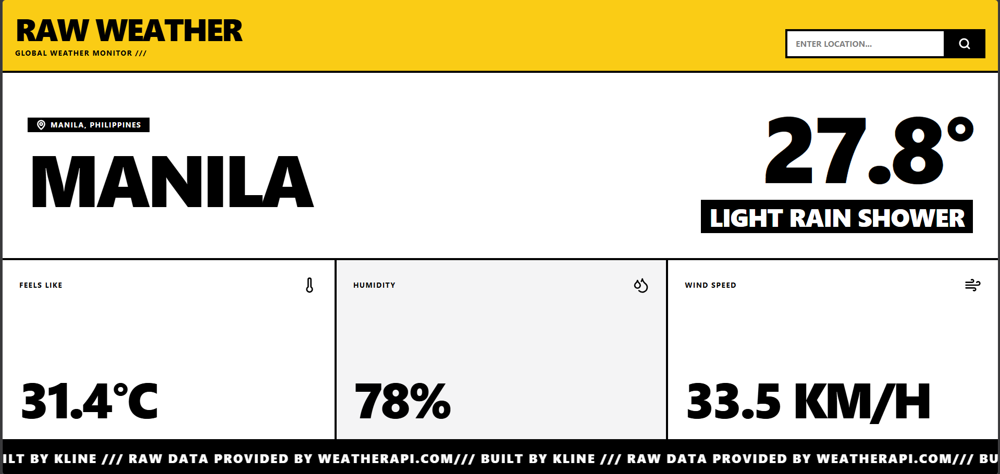

# RAW WEATHER /// Global Weather Monitor

[**View Live Deployment**](INSERT_YOUR_VERCEL_OR_NETLIFY_LINK_HERE)

RAW WEATHER is a brutalist, high-contrast web application designed to deliver real-time meteorological data and active severe weather alerts. Stripped of soft UI elements and gradients, this project focuses on raw function, utilizing aggressive typography, heavy grid structures, and seamless API integrations.



## Core Features
* **Real-Time Telemetry:** Fetches up-to-the-minute global weather data including temperature, humidity, and wind speed.
* **Automated Geolocation:** Immediately locates the user via browser API to provide localized data upon load.
* **Precision Search:** Features a debounced autocomplete search utilizing WeatherAPI's search endpoint to prevent unnecessary API calls.
* **Active Threat Ticker:** Parses severe weather warnings and displays them via a continuous, high-visibility scrolling marquee.
* **Responsive Brutalism:** Fully responsive architecture that scales dynamic typography mathematically from desktop monitors down to mobile screens without breaking the grid.

## Tech Stack
* **Framework:** React + Vite
* **Styling:** Tailwind CSS
* **Icons:** Lucide React
* **Data Provider:** [WeatherAPI](https://www.weatherapi.com/)

## Local Development

1. **Clone the repository:**
   ```bash
   git clone [https://github.com/pndesal1295/weather-alerts.git](https://github.com/pndesal1295/weather-alerts.git)
   cd weather-alerts
```

2. **Install dependencies:**
    ```bash
    npm install
```

3. **Configure Environment Variables:**
Create a .env file in the root directory and add your WeatherAPI key:
    ```Code snippet
    VITE_WEATHER_API_KEY=your_api_key_here
```


4. **Start the development server:**
    ```bash
    npm run dev
```


## Author
**Kline Olasiman**
